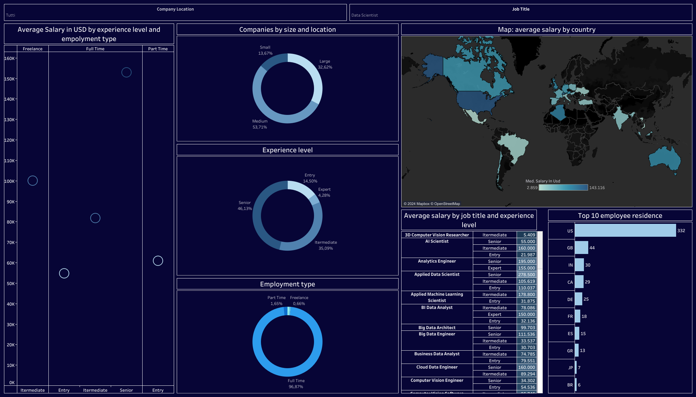

# Tableau - Data Science Salaries Portfolio Project  

### 📊 Interactive Dashboard  
Explore the full interactive version on **[Tableau Public](https://public.tableau.com/views/DataSciencesalaryanalysis_17159431692040/Dashboard1?:language=en-US&publish=yes&:sid=&:display_count=n&:origin=viz_share_link)**  

### 📄 Data Source  
The dataset used in this analysis is from **[Kaggle: Data Science Job Salaries](https://www.kaggle.com/datasets/ruchi798/data-science-job-salaries)**  

### 📈 Dashboard Preview  
  

This project analyzes Data Science job salaries using **Tableau**, providing insights into salary trends across different roles, experience levels, and locations.  

